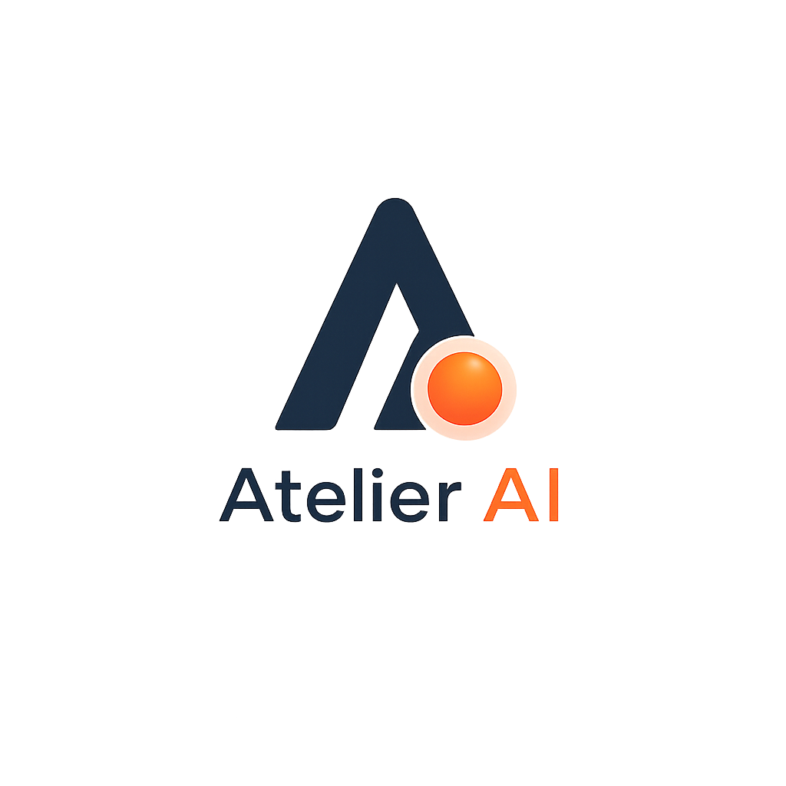
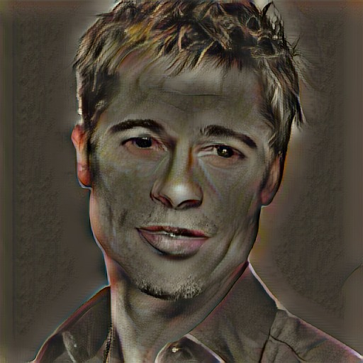
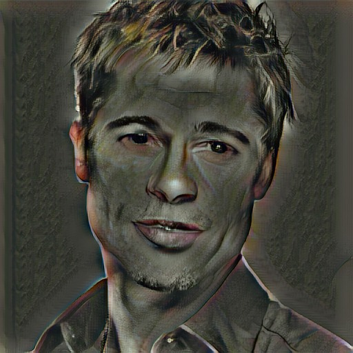
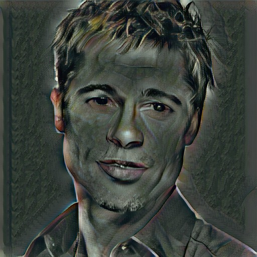
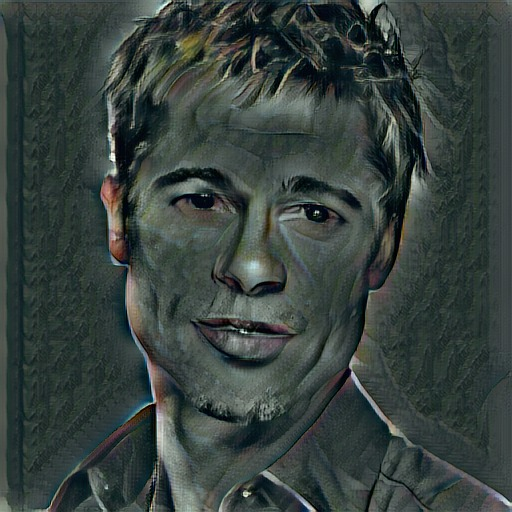
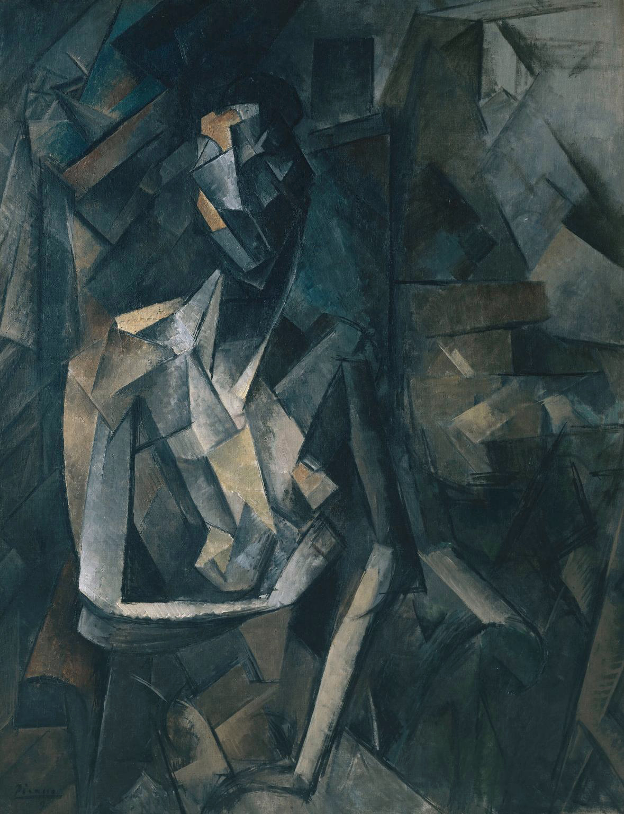

<div align="center">



### Neural style transfer studio — turn any photo into art using the style of any artwork, powered by a local AdaIN network.

<p>
  
  
  
  
  
</p>

<p>
  <a href="#quick-demo"><b>Quick demo</b></a> &nbsp;•&nbsp;
  <a href="#how-it-works"><b>How it works</b></a> &nbsp;•&nbsp;
  <a href="#architecture"><b>Architecture</b></a> &nbsp;•&nbsp;
  <a href="#tech-stack"><b>Tech stack</b></a> &nbsp;•&nbsp;
  <a href="#setup"><b>Setup</b></a> &nbsp;•&nbsp;
  <a href="#api"><b>API</b></a> &nbsp;•&nbsp;
  <a href="#training"><b>Training</b></a> &nbsp;•&nbsp;
  <a href="#gallery"><b>Gallery</b></a>
</p>

</div>

<br>

## Quick demo

| Upload | Tune alpha | Download |
|:------:|:----------:|:--------:|
| **Drag & drop any two images** | **Slide 0.1 – 1.0 in real time** | **One-click save** |

<br>

## UI walkthrough

### Landing page — `GET /`

> A full-featured landing page with animated canvas hero, inline upload form, gallery, and carousel — all wired to the real backend.

| Section | What you see |
|---------|-------------|
| **Hero** | Animated neural-network canvas background, "Create beautiful. Beyond boundaries. Infinite style." CTA buttons |
| **How It Works** | 3-step process cards with mono step numbers (01 / 02 / 03) |
| **Style Gallery** | 5 real generated samples at α = 0.30 → 1.00 — every image produced by the actual model, no stock art |
| **Upload Form** | Two dropzones (content + style), alpha slider (0.1–1.0), "Generate artwork" button with live progress bar |
| **Features** | 4 feature cards (speed, control, architecture, privacy) |
| **Carousel** | Auto-advancing before/after comparison of generated outputs |
| **Footer** | Brand, navigation links, stack info |

### Results page — `GET /stylize?uid=<id>`

| Section | What you see |
|---------|-------------|
| **Before / After comparison** | Draggable slider: left side = original content, right side = stylized result |
| **Style reference** | Thumbnail of the uploaded style image |
| **Adjustment controls** | Alpha slider + "Re-stylize" button — re-renders the result with a new strength in real time |
| **Download options** | Download result (.jpg) + download original |
| **Share** | Copy link, native Web Share API, WhatsApp, X (Twitter), Facebook |
| **Try Another Style** | CTA button back to landing page |

### Style Gallery — "Real transformations, generated live"

> Every example below is produced by the actual model powering this studio — no stock images.

| α = 0.30 | α = 0.50 | α = 0.70 | α = 0.85 | α = 1.00 |
|:---------:|:---------:|:---------:|:---------:|:---------:|
|  |  |  |  |  |

> Content: portrait photograph · Style: Cubist painting (teal/ochre palette) · Generated via AdaIN with α-scaled Reinhard color transfer

### Input images used

| Content image | Style image |
|:-------------:|:-----------:|
|  |  |

<br>

## How it works

### The pipeline

<details open>
<summary><b>Show diagram</b></summary>

```
┌────────────────────┐          ┌────────────────────┐
│                    │          │                    │
│   Content Image    │          │    Style Image     │
│   (your photo)     │          │  (any painting)    │
│                    │          │                    │
└────────┬───────────┘          └────────┬───────────┘
         │                               │
         ▼                               ▼
┌─────────────────────────────────────────────────────┐
│                   VGG19 Encoder                     │
│            (frozen — no weight updates)             │
│                                                     │
│   relu1_1 → relu2_1 → relu3_1 → relu4_1            │
│     64ch     128ch     256ch     512ch              │
└──────────────────────┬──────────────────────────────┘
                       │
               ┌───────┴───────┐
               ▼               ▼
         content_feat    style_feat
               │               │
               └───────┬───────┘
                       ▼
              ┌─────────────────┐
              │  AdaIN Adapter  │
              │                 │
              │  align style    │
              │  mean/std to    │
              │  content        │
              │                 │
              │  t = σ(style) × │
              │  (x - μ(content))│
              │  / σ(content)   │
              │  + μ(style)     │
              └────────┬────────┘
                       │
            t = α × styled + (1 - α) × content
                       │
                       ▼
              ┌─────────────────┐
              │     Decoder     │
              │                 │
              │  512 → 256      │
              │  256 → 256 × 3  │
              │  256 → 128      │
              │  128 → 64       │
              │  64  → 3 (RGB)  │
              │  3× Upsample    │
              └────────┬────────┘
                       │
                       ▼
              ┌─────────────────┐
              │ Reinhard Color  │
              │ Transfer        │
              │                 │
              │ YCbCr space     │
              │ α-scaled blend  │
              └────────┬────────┘
                       │
                       ▼
              ┌─────────────────┐
              │   Output Image  │
              │                 │
              │  Content shape  │
              │  + Style colors │
              │  + Style texture│
              └─────────────────┘
```

</details>

### Three steps

| Step | Action | What happens under the hood |
|------|--------|----------------------------|
| **01** | Upload | Save both images, assign a unique session ID |
| **02** | Generate | VGG19 extracts features → AdaIN aligns style stats → decoder renders output → Reinhard color transfer blends style palette |
| **03** | Download | One-click save of the stylized result at full resolution |

<br>

## Architecture

### Encoder — VGG19 (frozen)

The encoder uses a pretrained VGG19 network, frozen entirely (no gradient updates). Four blocks extract hierarchical features up to `relu4_1`:

| Block | Layers | Output shape | Channels | Downsample |
|-------|--------|:-------------:|:---------:|:------------:|
| `enc_1` | conv1_1, relu1_1 | (N, 64, H, W) | 64 | — |
| `enc_2` | conv→pool→conv | (N, 128, H/2, W/2) | 128 | × 2 |
| `enc_3` | conv→pool→conv | (N, 256, H/4, W/4) | 256 | × 4 |
| `enc_4` | conv×3→pool→conv | (N, 512, H/8, W/8) | 512 | × 8 |

### Decoder (trainable)

Mirror architecture with reflection padding and nearest-neighbor upsampling:

| Layer | In → Out | Activation |
|-------|:---------:|:------------:|
| ReflectionPad2d + Conv | 512 → 256 | ReLU |
| Upsample (×2) | — | — |
| ReflectionPad2d + Conv | 256 → 256 | ReLU |
| ReflectionPad2d + Conv | 256 → 256 | ReLU |
| ReflectionPad2d + Conv | 256 → 256 | ReLU |
| ReflectionPad2d + Conv | 256 → 128 | ReLU |
| Upsample (×2) | — | — |
| ReflectionPad2d + Conv | 128 → 128 | ReLU |
| ReflectionPad2d + Conv | 128 → 64 | ReLU |
| Upsample (×2) | — | — |
| ReflectionPad2d + Conv | 64 → 64 | ReLU |
| ReflectionPad2d + Conv | 64 → 3 | (none) |

Total: **8× upsampling** from relu4_1 → full resolution.

### AdaIN — Adaptive Instance Normalization

Given content feature `x_c` and style feature `x_s`:

```
adain(x_c, x_s) = σ(x_s) × (x_c - μ(x_c)) / σ(x_c) + μ(x_s)
```

- `μ`, `σ`: per-channel mean and standard deviation
- The output `t` is interpolated with the original content feature:

```
t = α × adain(x_c, x_s) + (1 - α) × x_c
```

### Loss functions (training)

| Loss | Formula | Purpose |
|------|---------|---------|
| **Content loss** | `MSE(encoder(output)[relu4_1], t)` | Output must match the AdaIN-transformed target |
| **Style loss** | `Σ MSE(μ(output_i), μ(style_i)) + MSE(σ(output_i), σ(style_i))` for i ∈ {relu1_1, relu2_1, relu3_1, relu4_1} | Output statistics must match style at all layers |

Weighted: `loss = 1.0 × content_loss + 10.0 × style_loss`

### Post-processing

1. **Reinhard color transfer** — YCbCr space, matches output channel statistics to the style image, scaled by α
2. **Sharpening** — mild `ImageEnhance.Sharpness(1.2)` to counteract decoder blur

<br>

## Tech stack

### Backend

| Layer | Technology | Purpose |
|-------|-----------|---------|
| **Web framework** | Flask 3.0.3 | HTTP routing, templates, static file serving |
| **Deep learning** | PyTorch 2.3 + torchvision 0.18 | VGG19 encoder, AdaIN, decoder inference |
| **Image processing** | Pillow 10.3 | Image I/O, resize, color conversion, enhancement |
| **Numerical** | NumPy 1.26 | Array operations for color transfer |
| **Production server** | Gunicorn 22.0 | WSGI deployment |

### Frontend

| Layer | Technology | Purpose |
|-------|-----------|---------|
| **Typography** | Geist (Google Fonts) | Display headings + body copy |
| **Monospace** | JetBrains Mono (Google Fonts) | Labels, step numbers, metadata badges |
| **CSS** | Custom design system (Auralis palette) | Zero dependencies, CSS variables, pill buttons |
| **Canvas animation** | Vanilla JS (requestAnimationFrame) | Hero neural-network particle field |
| **Upload flow** | Fetch API + FormData | AJAX upload with live progress bar |
| **Before/after** | CSS clip-path + range input | Draggable comparison slider |
| **Sharing** | Web Share API + social URLs | Native share + WhatsApp / X / Facebook |

### Design system (Auralis)

<details>
<summary><b>Show full token table</b></summary>

| Token | Value | Usage |
|-------|-------|-------|
| `primary` | `#EA580C` | CTA buttons, active states, accent borders |
| `accent` | `#FDBA74` | Alpha labels, badge accents, hover states |
| `surface` | `#191C21` | Dark sections (hero, studio, showcase, footer) |
| `background` | `#FFFFFF` | Light sections (how-it-works, gallery, features) |
| `text-primary` | `#111827` | Main body text |
| `text-secondary` | `#4B5563` | Descriptions, hints |
| `border` | `#E5E7EB` | Card borders, dividers |
| `radius-card` | `8px` | All card corners |
| `radius-ctrl` | `8px` | Input fields, range sliders |
| `radius-pill` | `9999px` | Buttons, badges |
| `card-padding` | `24px` | Internal card spacing |
| `section-padding` | `80px` | Vertical section spacing |
| `display-lg` | Geist 64px, 500wt, 1.04lh | Hero title |
| `body-md` | Geist 16px, 400wt, 1.6lh | Body copy |
| `label-md` | JetBrains Mono 12px, 600wt | Technical labels |
| `shadow` | `0 1px 2px rgba(16,24,40,.05), 0 8px 24px -12px rgba(16,24,40,.12)` | Card depth |
| `shadow-lg` | `0 2px 4px rgba(16,24,40,.06), 0 24px 48px -16px rgba(16,24,40,.22)` | Hover / elevated cards |
| `ease` | `cubic-bezier(.22,1,.36,1)` | All transitions |

</details>

<br>

## Setup

### Requirements

```
Flask==3.0.3
torch==2.3.0
torchvision==0.18.0
Pillow==10.3.0
numpy==1.26.4
tqdm==4.66.4
gunicorn==22.0.0
```

### Quick start

```bash
# 1. Clone
git clone https://github.com/YOUR_USERNAME/atelier-ai.git
cd atelier-ai

# 2. Create virtual environment
python -m venv venv

# 3. Activate (Windows)
venv\Scripts\activate

# 4. Install dependencies
pip install -r requirements.txt

# 5. Run
cd flask_app
python app.py
```

Open **http://127.0.0.1:5000**

### Production

```bash
cd flask_app
gunicorn -w 1 -b 0.0.0.0:5000 app:app
```

> Single worker (`-w 1`) because the VGG19 model is ~550 MB in memory per process.

<br>

## Repo layout

<details>
<summary><b>Show full directory tree</b></summary>

```
Atelier AI/
│
├── flask_app/                          ← Web application
│   ├── app.py                          ← Flask routes + JSON API
│   ├── inference.py                    ← Model loading, style transfer, post-processing
│   ├── network.py                      ← VGG19 encoder + AdaIN + decoder definition
│   ├── models/
│   │   └── decoder_final.pth           ← Trained decoder weights
│   │
│   ├── templates/
│   │   ├── _nav.html                   ← Shared navigation bar
│   │   ├── _footer.html                ← Shared footer
│   │   ├── index.html                  ← Landing page (hero, how-it-works, gallery, upload, features, carousel)
│   │   └── result.html                 ← Results page (before/after, download, adjust, share)
│   │
│   ├── static/
│   │   ├── css/style.css               ← Full design system (Auralis palette, Geist/JetBrains Mono)
│   │   ├── js/main.js                  ← Landing page JS (canvas hero, upload flow, gallery, carousel)
│   │   ├── js/result.js                ← Results page JS (comparison slider, re-stylize, share)
│   │   ├── gallery/                    ← Pre-generated demo samples (5 alphas)
│   │   ├── uploads/                    ← User uploads (runtime)
│   │   └── results/                    ← Generated outputs (runtime)
│   │
│   └── requirements.txt
│
├── kaggle_training/                    ← Kaggle training pipeline
│   ├── train.py                        ← Training loop (40k iters, Adam, decay LR)
│   ├── network.py                      ← Full AdaIN net with content + style losses
│   ├── dataset.py                      ← Flat folder dataset (corrupted-image fallback)
│   └── prepare_data.py                 ← Dataset extraction (COCO + Painter by Numbers)
│
├── docs/
│   └── screenshots/                    ← README screenshot assets
│       ├── content.jpg
│       ├── style.jpg
│       ├── gallery/
│       └── ui/
│
├── requirements.txt
└── README.md
```

</details>

<br>

## API

### `POST /stylize`

Stylize a content image with a style image.

**Request** (multipart/form-data):

| Field | Type | Required | Description |
|-------|------|:----------:|-------------|
| `content_image` | file | ✓ | Content image (PNG, JPG, JPEG, BMP, WEBP) |
| `style_image` | file | ✓ | Style image (PNG, JPG, JPEG, BMP, WEBP) |
| `alpha` | float | ✓ | Style strength: 0.1 (subtle) → 1.0 (full) |

**Response** (JSON, 200):

```json
{
  "uid": "4fe509fa66914bde9376eb288ed8237d",
  "content_url": "/static/uploads/4fe509..._content_photo.jpg",
  "style_url": "/static/uploads/4fe509..._style_painting.jpg",
  "before_url": "/static/results/4fe509..._before.jpg",
  "result_url": "/static/results/4fe509..._result_70.jpg",
  "alpha": 0.7
}
```

### `POST /restylize`

Re-render a result at a new alpha value.

**Request** (JSON):

```json
{
  "uid": "4fe509fa66914bde9376eb288ed8237d",
  "alpha": 0.5
}
```

**Response** (JSON, 200):

```json
{
  "result_url": "/static/results/4fe509..._result_50.jpg",
  "alpha": 0.5
}
```

### `GET /api/status?uid=<id>`

Poll whether a result is ready.

**Response** (JSON):

```json
{
  "ready": true,
  "result_url": "/static/results/4fe509..._result_70.jpg"
}
```

### `GET /api/samples`

Get pre-generated gallery samples.

**Response** (JSON array):

```json
[
  {
    "id": "demo_30",
    "title": "Cubist Portrait Study",
    "style_name": "Cubist Painting",
    "alpha": 0.3,
    "content_url": "/static/gallery/sample_demo_30_content.jpg",
    "style_url": "/static/gallery/sample_demo_30_style.jpg",
    "result_url": "/static/gallery/sample_demo_30_result.jpg"
  }
]
```

### `GET /`

Landing page (HTML). Renders hero, how-it-works, gallery, upload form, features, carousel, footer.

### `GET /stylize?uid=<id>`

Results page (HTML). Renders before/after comparison, download, alpha adjustment, share options.

<br>

## Training

### Hyperparameters

| Parameter | Value |
|-----------|-------|
| Optimizer | Adam |
| Learning rate | `1e-4`, decayed by `lr / (1 + 5e-5 × iteration)` |
| Max iterations | 40,000 |
| Batch size | 8 |
| Crop size | 256 × 256 |
| Content weight | 1.0 |
| Style weight | 10.0 |
| Save checkpoint every | 1,000 iterations |

### Data

| Dataset | Role | Count |
|---------|------|-------|
| [COCO](https://cocodataset.org/) | Content images | ~10,000 |
| [Painter by Numbers](https://www.kaggle.com/c/painter-by-numbers) | Style images | ~10,000 |

### To retrain

```bash
cd kaggle_training

# 1. Prepare data (run on Kaggle with GPU)
python prepare_data.py

# 2. Train
python train.py
```

Change `max_iter` in `train.py` for better results:

| Iterations | Quality |
|-----------|---------|
| 40,000 | Decent (shipped) |
| 80,000 | Good |
| 160,000 | High fidelity |

After training, copy `decoder_final.pth` to `flask_app/models/`.

<br>

## Performance

| Metric | Value |
|--------|-------|
| Inference time (CPU, 512px) | ~3–5 seconds |
| Inference time (GPU, 512px) | < 1 second |
| Model size (decoder) | ~15 MB |
| VGG19 weights (encoder) | ~548 MB |
| Max input resolution | 512 × 512 (configurable) |

<br>

